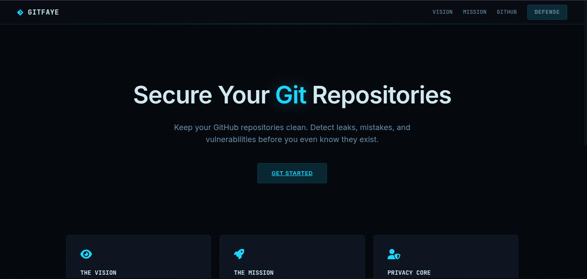
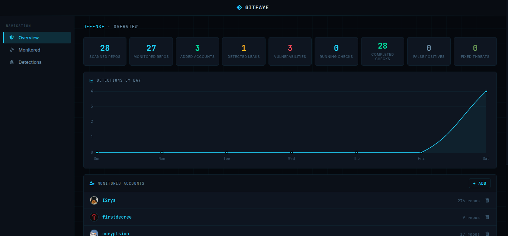

<div align="center"></div>
<div align="center"><h3>GitFaye</h3><p>Keep your GitHub repositories clean. Detect leaks, mistakes, and vulnerabilities before you even know they exist.</p></div>
<div align="center">

[](https://nodejs.org/en/blog/release/v25.0.0)
[](https://github.com/firstdecree/gitfaye/releases/)
[](/LICENSE)
[](https://github.com/firstdecree/gitfaye)

</div>

# ⚙️ Installations
## Github
```
git clone https://github.com/firstdecree/gitfaye
```

## NpmJS
```
npm install
```

## PNPM
```
pnpm install
```

# 🛠️ Setup
In order to run GitFaye, it is first necessary to configure it by making adjustments to the `example.config.toml` (remove the `example.` part in the name afterwards) file. All of the necessary descriptions for each variable are already included.

# 🚀 Usage
After running the command below, visit http://localhost:8080/
```
node index.js
```

Updating the plugins (only run once or regularly).
```
node index.js --update-plugins
```

# 🔗 Related
- [GitFaye Plugins](https://github.com/firstdecree/gitfaye-plugins): A collection of GitFaye plugins. These plugins are for scanners, checkers and more.

# 🌟 Patrons
<table border="1">
    <tr>
        <td style="text-align: center; padding: 10px;">
            
            <br>
            <p align="center"><a href="https://vexhub.dev/">Vexhub Hosting</a></p>
        </td>
    </tr>
</table>

<div align="center">
  <sub>This project is distributed under <a href="/LICENSE"><b>MIT License</b></a></sub>
</div>